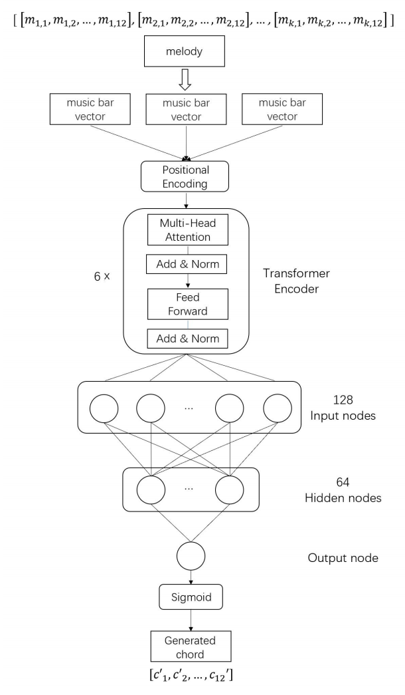

# TCH-Chord: Chord Generation based on Transformer Model and Color Harmony Theory

## Introduction

This implementation corresponds to the research paper [https://www.researchgate.net/publication/374821772_Chord_Generation_Based_on_Transformer_and_Color_Harmony_Theory]. AI transforms music with widespread applications. The paper introduces a Transformer-based chord model, achieving the functionality of generating corresponding chords for a given melody. By incorporating Color Harmony Theory, it aims for superior output through a simple model and enhanced scalability using a template mapping method.

The architecture of the model is illustrated in the following diagram:



## Getting Started

### Prerequisites

- Python 3.9 (Recommended)

### Installation

1. Clone the repository:

    ```bash
    git clone https://github.com/your-username/TCH-Chord.git
    ```

2. Navigate to the project directory:

    ```bash
    cd TCH-Chord
    ```

3. Create and activate a virtual environment (optional):

    ```bash
    python3 -m venv venv  # Create a virtual environment
    source venv/bin/activate  # Activate the virtual environment (Linux or macOS)
    ```

4. Install dependencies:

    ```bash
    pip install -r requirements.txt
    ```

## Usage

To train the model:

```bash
cd CODE
python main.py
```

**Parameters and settings** can be found in the CODE/config folder.

Feel free to embark on your musical journey with TCH-Chord! If you have any questions, feedback, or would like to contribute, please open an issue. Happy coding and composing!